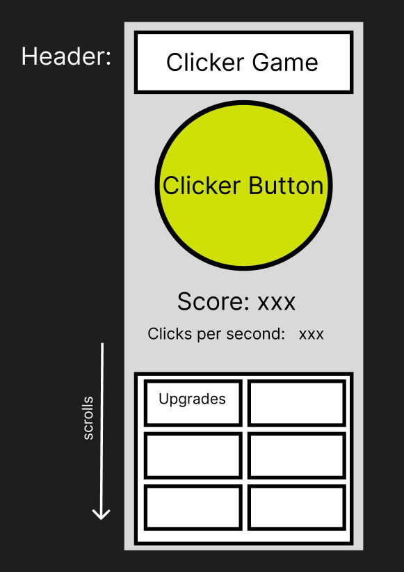
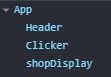
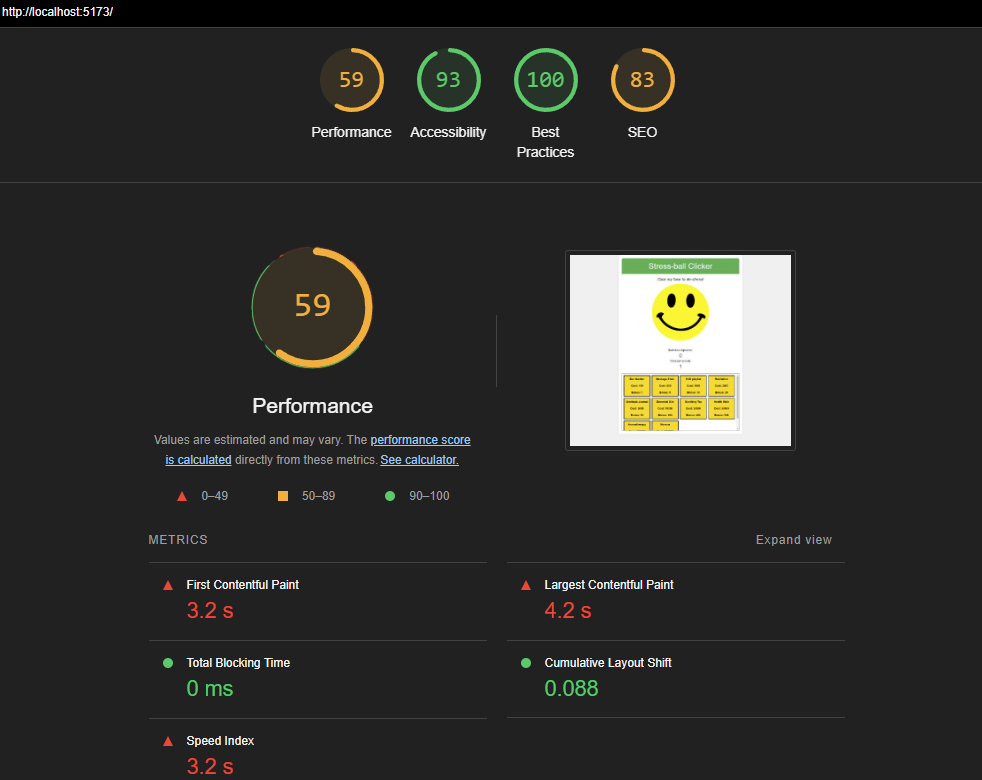

# User Stories and Requirements

🐿️ As a user, I want to be able to click the cookie and increment the counter
🐿️ As a user, I want to see the counter automatically increment using an interval timer
🐿️ As a user, I want to purchase items i can afford in the shop and increase the number of cookies every time the interval passes

🎯 Create state variables to store the current number of cookies and the cookies PerSecond value (useState)

🎯 Set up a timer to increment the number of cookies by the cookiesPerSecond value (useEffect). Be sure to handle clearing the timer using the useEffect return value.

🎯 Set up an array of objects containing the items available for purchase in the store, their cost and their increment increase value. Map through these and create buttons for each.

🎯 Create a function to handle the purchase of an item. This should check if the user has enough cookies to purchase the item, and if so, subtract the cost of the item from the number of cookies and add the increment value to the cookiesPerSecond value.

# Please also provide an assignment reflection in your project README.md file.

(Required)
🎯 Please mention the requirements you met and which goals you achieved for this assignment.

- I think I met the base requirements, however I was extremely short on time this weekend and even with the extension I'm not happy that I couldn't try any stretch goals.

🎯 Were there any requirements or goals that you were not quite able to achieve?

- Aside from stretch goals no.

🎯 If so, could you please tell us what was it that you found difficult about these tasks?

- I found passing props really difficult to conceptualise, I also found the little idiosyncrasies of React a little frustrating as some of them are not very logical at first glance. For example the many callback functions in the timer component. I know there is a reason for them, but it's hard to remember the code.

# wireframe

- react component tree
  
- lighthouse?
  

(Optional)

- 🏹 Feel free to add any other reflections you would like to share about your submission e.g.

- What went really well and what could have gone better?

Considering the time I had, I'm happy I made an app that has basic functionality. I would have loved to style it better, add more features etc. I really liked the component methodology in React and I hope to get much better at it. I still need to get more familiar with React in general

- Detailing useful external sources that helped you complete the assignment (e.g Youtube tutorials).

The usual of Google, stackoverflow, GPT for debugging but this time I got a lot of help from Emily on the course since I was very short on time. Many thanks to her!

- Describing errors or bugs you encountered while completing your assignment.
